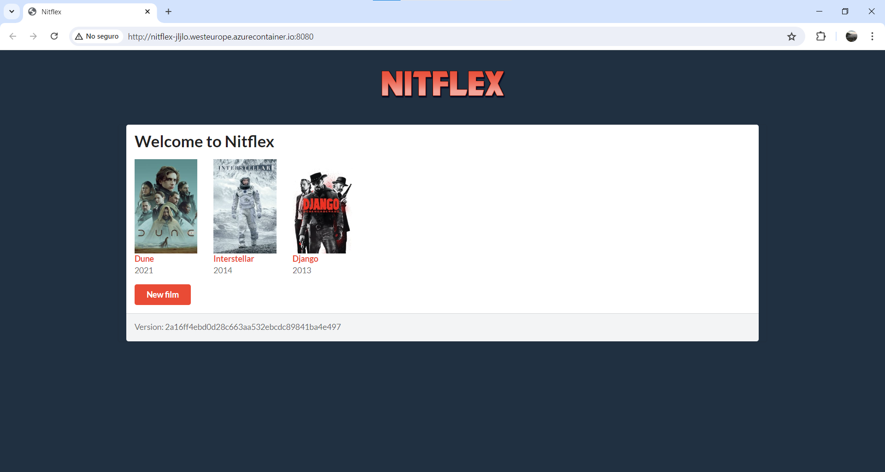

AIS-Practicas-4y5-2024

Autor(es): Jorge Leal & Javier Laureano Ochoa

[Repositorio](https://github.com/Javier8aa/ais-jl.ochoa-j.leal-2024-tbd)

[Aplicación Azure](http://nitflex-jljlo.westeurope.azurecontainer.io:8080/)

Antes de comenzar la practica 5, y con ello el fix y la funcionalidad, hicimos varias pruebas para verificar el correcto funcionamiento de los workflows, desencadenando así algún action invalido debido a fallos en azure con semver

Por lo que la práctica 5 comienza tras el commit "Readme actualizado previo P5" y la etiqueta de git

## Desarrollo con GitHubFlow (Práctica 5)

Una vez creados los workflows y funcionando estos, pasamos a crear la nueva funcionalidad utilizando GithubFlow:

Clonamos el repositorio
 
1. Clonamos los repositorios
```
$ git clone https://github.com/Javier8aa/ais-jl.ochoa-j.leal-2024-tbd.git
```

2. Creamos rama del fix (Javier)
```
$ git checkout -b fix/cancel-button-bug
```

3. Añadimos arreglo bug y test del fix (Javier)
```
$ git add .
```

4. Realizamos el commit del fix (Javier)
```
$ git commit -m "Fix cancel button bug and add regression test"
```

5. Realizamos el push del fix (Javier)
```
git push origin fix/cancel-button-bug
```
Ejecución Workflow1 [Workflow 1](https://github.com/Javier8aa/ais-jl.ochoa-j.leal-2024-tbd/actions/runs/9806163658)


Los siguientes 3 pasos (6, 7 y 8) son necesarios para el correcto etiquetado siguiendo el formato semver, sin embargo, como nos has comentado en el correo, como en nuestro caso, el error "RegistryErrorResponse" sucede al cambiar la version del pom ya que nuestro contenedor es previo al cambio de políticas seguiremos la practica sin cambiar la versión del Pom pero indicando como debería hacerse
6. Realizamos un cambio de version en el Pom siguiendo semver (version 0.1.1) (Javier)
```
$ git add .
```

7. Realizamos el commit de la version del Pom (Javier)
```
$ git commit -m "Semver version 0.1.1"
```

8. Realizamos el push de la version del Pom (Javier)
```
git push origin fix/cancel-button-bug
```
Aqui deberia ejecutarse nuevamente el Workflow 1, pero en nuestro caso al no modificar el pom no se ejecuta

9. Abrimos un pull request del fix (Javier)

Pull request [Pull Request](https://github.com/Javier8aa/ais-jl.ochoa-j.leal-2024-tbd/pull/9)

Ejecución Workflow2 [Workflow 2](https://github.com/Javier8aa/ais-jl.ochoa-j.leal-2024-tbd/actions/runs/9806576053)

10. Hacemos el merge del pull request del fix (Javier)

Ejecución Workflow 3 [Workflow 3](https://github.com/Javier8aa/ais-jl.ochoa-j.leal-2024-tbd/actions/runs/9806605015)

Imagen Docker con tag: [Imagen Docker Hub Tag](https://hub.docker.com/layers/jorgexleal/nitflex/0.1.0/images/sha256-db0b5de4ef90def97c1eedb86dc53861b64392385fbd095ba48ecdd9ffe93e40?context=repo)

Como se puede observar, el tag de la imagen continua siendo 0.1.0, pero de haber modificado el pom, deberia ser 0.1.1 y por tanto mostrarse así en el tag de la imagen Docker

Captura de la aplicación desplegada tras el fix:

